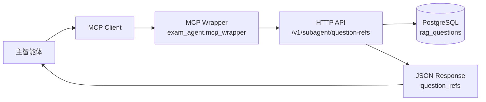
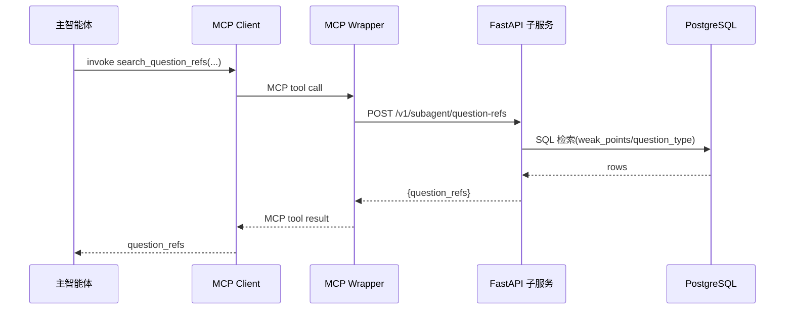

# getPaperAgent

数学题库检索子智能体（Python + FastAPI + PostgreSQL）。

## 当前定位

本项目当前作为主智能体的 SubAgent 使用：

- 子智能体职责：检索题目并返回 `question_refs`
- 主智能体职责：组卷策略、题目拼装、渲染与 PDF 输出

## 架构图



说明：

- 业务能力集中在 HTTP 子服务（检索与返回引用）。
- MCP Wrapper 只做协议适配与转调，不重复实现检索逻辑。
- 主智能体拿到 `question_refs` 后自行完成组卷与渲染。

## 调用流程图



说明：

- `question_type` 用于题型筛选（选择/填空/解答）。
- `kaodian_no/kaodian_name` 用于知识点命中检索。
- 推荐主智能体透传 `trace_id` 做全链路观测。

## 核心能力

- PostgreSQL 实时检索
- 按知识点（`kaodian_no/kaodian_name`）检索
- 按题型（`question_type`）筛选：`选择/填空/解答`
- 返回标准题目引用（`question_refs`）供主智能体编排

## 数据表说明

主表：`rag_questions`

关键字段：

- `id`
- `topic`
- `question_no`
- `question_type`（已新增并回填）
- `kaodian_no`
- `kaodian_name`
- `stem_md`
- `analysis_md`
- `image_urls`

## 环境准备

```powershell
cd E:\Agent-do\code
python -m pip install -e .
python -m pip install fastapi uvicorn psycopg[binary] psycopg2-binary
```

## PostgreSQL 配置

```powershell
$env:PGHOST="127.0.0.1"
$env:PGPORT="5433"
$env:PGDATABASE="kch-learn"
$env:PGUSER="postgres"
$env:PGPASSWORD="wang5874579%"
```

## 启动服务

```powershell
$env:PYTHONPATH="E:\Agent-do\code\src_py"
python -m exam_agent.serve --host 127.0.0.1 --port 8000
```

## 子智能体接口

- `GET /health`
- `POST /v1/subagent/question-refs`

## MCP 包装层（新增）

已提供 MCP Wrapper：`src_py/exam_agent/mcp_wrapper.py`  
该 Wrapper 暴露 MCP 工具 `search_question_refs`，内部转调：

- `POST /v1/subagent/question-refs`

启动方式（先启动 HTTP 服务，再启动 MCP Wrapper）：

```powershell
$env:PYTHONPATH="E:\Agent-do\code\src_py"
python -m exam_agent.mcp_wrapper
```

工具参数核心字段：

- `trace_id`
- `user_id`
- `grade`
- `subject`（默认 `math`）
- `weak_points`
- `preferred_question_types`（`选择/填空/解答`）
- `limit`
- `base_url`（默认 `http://127.0.0.1:8000`）

### 调用示例

```json
{
  "trace_id": "trace-001",
  "user": {
    "user_id": "u_001",
    "grade": "高三"
  },
  "learning_context": {
    "subject": "math",
    "weak_points": ["导数", "圆锥曲线"]
  },
  "paper_request": {
    "preferred_question_types": ["选择", "解答"],
    "limit": 60
  },
  "extra_context": {}
}
```

### 返回示例（节选）

```json
{
  "status": "ok",
  "trace_id": "trace-001",
  "subject": "math",
  "count": 60,
  "question_refs": [
    {
      "id": 123,
      "topic": "专题26 导数...",
      "question_no": "38",
      "question_type": "解答",
      "kaodian_no": "04",
      "kaodian_name": "利用导数研究函数最值",
      "source_table": "rag_questions"
    }
  ]
}
```

## 文档索引

- `../doc/项目文档整合总览.md`
- `../doc/math_exam_agent_技术实现说明.md`
- `../doc/math_exam_subagent_改造方案_v1.md`
- `../doc/mcp接入调研报告_主从智能体_2026-05-27.md`
